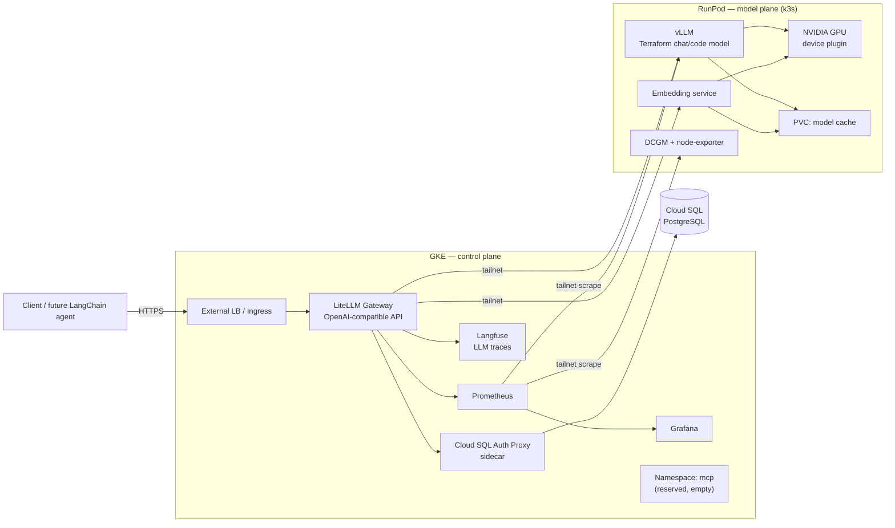

# terraforge-inference

## 1. Objective

`terraforge-inference` is the inference foundation for a future LangChain RAG agent that writes, explains, reviews, and validates Terraform code.

This project does not build the agent. It builds the production-style inference layer the agent will consume later.

Phase 1 is split across two clouds:

- **RunPod** hosts the GPU model plane: vLLM and the embedding model, on k3s.
- **GKE** hosts the control plane: LiteLLM, Cloud SQL, observability, and tracing.

The two planes are joined by a private mesh. Only LiteLLM on GKE is reachable from the public internet.

## 2. Architecture



### Traffic flow

1. The client calls the public LiteLLM endpoint on GKE with a LiteLLM virtual key.
2. LiteLLM authenticates the key, checks budget and rate limits against Cloud SQL, resolves the model alias.
3. LiteLLM forwards the request over the private mesh to vLLM or the embedding service on RunPod.
4. Usage, cost, and latency are written to Cloud SQL; traces go to Langfuse; metrics are scraped by Prometheus.

## 3. Core design decisions

### 3.1 LiteLLM is the only public surface

LiteLLM is the inference control plane. It provides the OpenAI-compatible API, stable model aliases, virtual keys, per-key model allowlists, budgets, rate limits, usage tracking, logging, and future fallback routing.

The future LangChain agent calls LiteLLM only. It never calls vLLM or the embedding service directly.

### 3.2 The cross-cloud link must make bypass impossible

Budgets and rate limits are enforced inside LiteLLM's own request path against Cloud SQL. The transport to RunPod does not affect whether they work.

What the transport does affect is **enforcement integrity**. If vLLM were reachable on a public RunPod proxy URL, that URL would be an unmetered side door: no key, no budget, no usage row, no trace. Every control in this plan would become advisory.

The requirement is therefore: **vLLM and the embedding service must be unreachable except from LiteLLM.**

**Decision: a Tailscale mesh between the two planes.** vLLM and the embedding service bind only tailnet addresses and are not on the public internet at all — bypass is impossible rather than merely gated. A second reason reinforces this: Prometheus on GKE must scrape vLLM `/metrics` and DCGM on RunPod, which is inbound traffic to RunPod. Over a tailnet that is an ordinary scrape. Behind the RunPod HTTP proxy it would require publicly exposing metrics endpoints, and a Cloudflare Tunnel would need a separate hostname per service. One mechanism solves both hops.

Rejected alternatives:

| Option | Why not |
|---|---|
| RunPod HTTP proxy + `--api-key` | Endpoint is public; enforcement holds only until the key leaks. Metrics scraping needs separate public exposure. |
| Cloudflare Tunnel | Outbound-only like Tailscale, but HTTP-per-hostname; awkward for Prometheus scraping and more setup than it earns here. |

### 3.3 Cloud SQL, kept deliberately light

LiteLLM's persistence (virtual keys, budgets, usage, spend) lives in Cloud SQL for PostgreSQL: smallest shared-core tier, **public IP**, reached through the **Cloud SQL Auth Proxy as a sidecar** in the LiteLLM pod.

This deliberately skips VPC peering and Private Service Access, which is the fiddly part of a Cloud SQL setup. It still gives IAM-authenticated, encrypted connections for roughly ten lines of manifest, and it can later be moved to a private IP without changing LiteLLM's config.

Langfuse also needs a PostgreSQL. Give it a second database on the same instance rather than a second instance.

### 3.4 Models stay on RunPod; GKE hosts no models

The embedding model runs on RunPod alongside vLLM, not on GKE CPU nodes. Both models share the GPU, the model cache PVC, and the same private tailnet. GKE runs no inference workloads at all — it stays a small, steady, non-GPU cluster.

If GPU memory turns out to be tight, run the embedding model on the RunPod pod's CPU before moving it off RunPod entirely; keeping both models on one plane is worth more than the last few milliseconds of embedding latency.

### 3.5 k3s stays on RunPod

RunPod keeps k3s rather than dropping to plain Docker. It costs a little more setup than two containers would, but it keeps deployment uniform across both planes — manifests, rollouts, and the CI/CD path look the same on either side — and leaves room for a second vLLM replica later without a migration.

RunPod's k3s does **not** need Traefik, an ingress, or PostgreSQL. Nothing on that plane is publicly served.

### 3.6 llm-d is deferred to phase 2+

With one model and one vLLM replica there is nothing meaningful to route, balance, or cache-optimize. llm-d's strengths — load-aware and prefix-cache-aware routing, inference autoscaling, fairness between interactive and batch traffic, prefill/decode disaggregation, multi-GPU and multi-node serving — all require multiple workers to matter.

Add llm-d only when one of these becomes true:

- two or more vLLM replicas are running
- cache-aware routing would measurably help (repeated system prompts, coding standards, provider docs, module context)
- inference-specific autoscaling is needed
- agent, eval, and batch jobs need fairness guarantees
- the model spans multiple GPUs or nodes

Target shape when it arrives:

```text
LiteLLM ──► llm-d ──┬──► vLLM worker 1
                    ├──► vLLM worker 2
                    └──► vLLM worker N
```

### 3.7 MCP is prepared, not built

MCP servers are tool interfaces for the future agent. Reserve the `mcp` namespace on **GKE** (they are tools, not models) and write `mcp/README.md`. Deploy nothing in phase 1.

Future candidates: GitHub MCP, filesystem/docs MCP, Terraform Registry MCP, cloud docs MCP, tflint/checkov/policy MCP, CI/CD MCP. All will be private services; LiteLLM becomes the common control point for keys, teams, and usage across both LLM and MCP access.

## 4. Component inventory

### RunPod — model plane

| Component | Purpose |
|---|---|
| k3s | Kubernetes runtime (no Traefik, no ingress) |
| NVIDIA device plugin | Expose the GPU to Kubernetes |
| vLLM | Serve the Terraform chat/code model |
| Embedding service | Serve the RAG embedding model |
| Model cache PVC | Hugging Face / vLLM / embedding weights |
| DCGM exporter | GPU metrics |
| node-exporter | Host metrics |
| Tailscale | Private mesh membership; no public exposure |

### GKE — control plane

| Component | Purpose |
|---|---|
| LiteLLM | Public OpenAI-compatible gateway, keys, budgets, routing |
| Cloud SQL Auth Proxy | Sidecar connection to Cloud SQL |
| Cloud SQL (PostgreSQL) | LiteLLM state + Langfuse database |
| Ingress / external LB | The single public entry point |
| Prometheus | Metrics, including cross-tailnet scrapes of RunPod |
| Grafana | Dashboards; authenticated if exposed |
| Langfuse | LLM traces, prompt analytics |
| kube-state-metrics | Cluster metrics |
| Tailscale operator | Egress path from LiteLLM/Prometheus to RunPod |
| `mcp` namespace | Reserved, empty |

Optional later: Loki or Grafana Alloy for centralized logs, OpenTelemetry, cert-manager once a domain exists, llm-d when scaling demands it, a vector database when RAG ingestion starts.

## 5. Networking and security boundary

- **Public:** the GKE ingress in front of LiteLLM. Nothing else, on either plane.
- **Private on GKE:** Cloud SQL, Prometheus, Langfuse, and the reserved `mcp` namespace. Grafana only with authentication if exposed.
- **Private on RunPod:** everything. vLLM, the embedding service, the model cache, DCGM, node-exporter. No ingress controller is installed.
- All GKE↔RunPod traffic crosses the tailnet, both the inference hop and the Prometheus scrape.

Security rules:

- Require a LiteLLM virtual key for every external request.
- Use separate keys for chat, embeddings, eval, and admin.
- Never commit real secrets; only `*.example.yaml` templates.
- Do not log secrets or credentials in prompts.
- Rotate keys through LiteLLM and Kubernetes secrets together.

Latency and cost notes: pick a GKE region close to the RunPod region, since every request now carries one extra internet round trip. Token streams flow RunPod→GKE, which is ingress to GCP and therefore free; only the small request bodies are GCP egress.

## 6. Storage

| Volume | Plane | Contents |
|---|---|---|
| `model-cache-pvc` | RunPod | Hugging Face, vLLM, and embedding model weights |
| `prometheus-pvc` | GKE | Metrics retention |
| `grafana-pvc` | GKE | Dashboards and configuration |
| Cloud SQL storage | GCP | LiteLLM state, Langfuse |

If the RunPod volume is not persistent across pod recreation, document that the model plane must be bootstrapped again and that first start will re-download weights.

## 7. Secrets

Kubernetes secrets on **RunPod**: `HF_TOKEN`, `VLLM_API_KEY` (defence in depth behind the tailnet), `EMBEDDING_API_KEY`, `TS_AUTHKEY`.

Kubernetes secrets on **GKE**: `LITELLM_MASTER_KEY`, `LITELLM_SALT_KEY`, `DATABASE_URL`, `VLLM_API_KEY`, `EMBEDDING_API_KEY`, `TS_AUTHKEY`, `LANGFUSE_SECRET`, plus the Cloud SQL service-account key or Workload Identity binding.

GitHub Actions secrets: `RUNPOD_HOST`, `RUNPOD_SSH_USER`, `RUNPOD_SSH_PRIVATE_KEY`, `GCP_PROJECT_ID`, `GCP_WORKLOAD_IDENTITY_PROVIDER` (or a service-account key), `GKE_CLUSTER`, `GKE_LOCATION`, `LITELLM_MASTER_KEY`, `LITELLM_SALT_KEY`, `HF_TOKEN`, `TS_AUTHKEY`.

## 8. Model selection

Choose based on actual RunPod GPU VRAM. A 24GB card comfortably fits a 7B coder model plus the embedding model; 16GB gets tight with both on the card.

Chat/code candidates:

- `Qwen/Qwen2.5-Coder-7B-Instruct`
- `Qwen/Qwen2.5-7B-Instruct`
- `mistralai/Mistral-7B-Instruct`
- `meta-llama/Llama-3.1-8B-Instruct`, if access and memory allow

Embedding candidates:

- `BAAI/bge-small-en-v1.5`
- `BAAI/bge-base-en-v1.5`
- `intfloat/e5-base-v2`
- `sentence-transformers/all-MiniLM-L6-v2`

Prioritize GPU for vLLM. Run embeddings on the RunPod CPU first if VRAM is constrained, and move them to the GPU only if embedding latency becomes a bottleneck.

## 9. LiteLLM configuration

### Aliases

Task-based names, so agent code never references a real model:

- `terraform-code-fast` — Terraform generation and explanation
- `terraform-rag-answer` — RAG answer generation
- `terraform-review` — review and evaluation
- `terraform-embed` — embeddings for future RAG

Later, when llm-d arrives, `terraform-code-scaled` maps to the distributed path without any client change.

### Virtual keys

| Key | Access |
|---|---|
| `admin-key` | All models plus management endpoints |
| `agent-dev-key` | `terraform-code-fast`, `terraform-rag-answer`, `terraform-embed` |
| `agent-prod-key` | Production aliases only |
| `eval-key` | `terraform-review` |
| `embedding-key` | `terraform-embed` only |

### Controls

Per-key request rate, per-key token limits, model allowlists, monthly budget values, and usage logging. These matter before the agent exists: a Terraform-writing agent retrieves context, plans, revises, and validates, so it burns tokens quickly if uncontrolled.

### Model map

Backends are addressed over the tailnet. With the Tailscale Kubernetes operator on GKE, the cleanest form is an egress ClusterIP service that forwards to the tailnet target, so LiteLLM keeps ordinary in-cluster DNS names:

```yaml
model_list:
  - model_name: terraform-code-fast
    litellm_params:
      model: openai/local-code-model
      api_base: http://vllm-egress.llm-system.svc.cluster.local:8000/v1
      api_key: os.environ/VLLM_API_KEY

  - model_name: terraform-rag-answer
    litellm_params:
      model: openai/local-code-model
      api_base: http://vllm-egress.llm-system.svc.cluster.local:8000/v1
      api_key: os.environ/VLLM_API_KEY

  - model_name: terraform-embed
    litellm_params:
      model: openai/local-embedding-model
      api_base: http://embed-egress.llm-system.svc.cluster.local:8000/v1
      api_key: os.environ/EMBEDDING_API_KEY

general_settings:
  master_key: os.environ/LITELLM_MASTER_KEY
  database_url: os.environ/DATABASE_URL
```

`DATABASE_URL` points at the Auth Proxy sidecar on localhost: `postgresql://litellm:<password>@127.0.0.1:5432/litellm`.

The direct MagicDNS form (`http://vllm.<tailnet>.ts.net:8000/v1`) also works if the operator is not used.

### Deferred LiteLLM features

- **Fallback routing** — meaningful once there is a second backend (llm-d, or an external provider for emergency continuity).
- **Caching** — add after the basic gateway works. Good candidates: Terraform explanation prompts, documentation Q&A, repeated module examples, common error explanations. Never cache prompts containing secrets or private infrastructure details.
- **Guardrails** — reject obvious secrets in prompts, redact sensitive outputs, require JSON output for evaluation tasks. Deep Terraform validation belongs in the future agent layer via `terraform fmt`, `terraform validate`, policy checks, and sandboxed plans.

## 10. Observability

Base stack on GKE: Prometheus, Grafana, kube-state-metrics, Langfuse. Scrape targets on RunPod over the tailnet: vLLM metrics, DCGM exporter, node-exporter.

Dashboards:

- Cluster health (both planes)
- GPU utilization
- LiteLLM gateway traffic
- vLLM serving latency
- Embedding service
- Cross-cloud link health
- Cost and token usage

Alerts:

- GPU memory above 90%
- vLLM pod restarts
- LiteLLM unavailable
- LiteLLM error rate above 5%
- p95 latency too high
- Embedding failure rate above 5%
- Cloud SQL unavailable
- **Tailnet link down** — this one is new and critical: it takes the whole platform offline while both planes still look individually healthy
- Disk usage above 80%; model cache nearly full
- API key budget exceeded

Track per request: count, token usage, latency, errors, selected alias, fallback events, and key/team attribution.

## 11. CI/CD

GitHub Actions, with two deployment paths since there are two planes:

```text
push to main
    ├── lint YAML, validate manifests
    ├── model plane:   SSH to RunPod → kubectl apply -f runpod/ → wait for rollout
    ├── control plane: auth to GCP → kubectl apply -f gke/ → wait for rollout
    └── smoke tests against the public LiteLLM endpoint
```

Assumptions: the RunPod pod is running with k3s installed and SSH available; the GKE cluster exists; both planes are already joined to the tailnet.

Smoke tests:

- `GET /v1/models`
- `POST /v1/chat/completions` with `terraform-code-fast`
- `POST /v1/embeddings` with `terraform-embed`
- a LangChain-compatible call against the LiteLLM endpoint
- a negative test: confirm vLLM is **not** reachable from outside the tailnet

## 12. Backup, recovery, runbooks

Back up: Cloud SQL (automated backups), LiteLLM config, all Kubernetes manifests, Grafana dashboards, Prometheus alert rules.

The model cache does not need backup — weights can be re-downloaded — but losing it slows recovery significantly.

Required runbooks:

- bootstrap RunPod and k3s
- create and bootstrap the GKE cluster
- join a new pod to the tailnet / rotate the auth key
- redeploy either plane
- rotate LiteLLM keys
- restart vLLM
- update the LLM or embedding model
- check GPU usage
- debug failed pods on either plane
- restore Cloud SQL
- diagnose a broken cross-cloud link
- rerun smoke tests

## 13. Repository structure

```text
terraforge-inference/
    PLAN.md
    Step.md
    README.md
    runpod/                     model plane
        namespaces.yaml
        device-plugin/
        storage/
        vllm/
        embedding/
        tailscale/
        monitoring/             dcgm, node-exporter
    gke/                        control plane
        namespaces.yaml
        litellm/                config, deployment, service, secrets.example.yaml
        cloudsql/               auth proxy sidecar, service account
        observability/          prometheus, grafana, kube-state-metrics, langfuse
        ingress/
        tailscale/              operator, egress services
        mcp/                    README only
    scripts/
        deploy-runpod.sh
        deploy-gke.sh
        smoke-litellm.sh
        smoke-embeddings.sh
        check-gpu.sh
        check-link.sh
    .github/workflows/
        deploy.yml
```

The existing empty `charts/`, `infra/`, and `litellm/` directories predate this layout and should be replaced by `runpod/` and `gke/`.

## 14. Deployment order

1. RunPod GPU pod, then k3s, then the NVIDIA device plugin
2. GKE cluster
3. Tailscale on both planes; verify connectivity across the mesh
4. RunPod: namespaces, secrets, model cache PVC
5. RunPod: vLLM, then the embedding service; test both from inside that cluster
6. Cloud SQL instance and databases
7. GKE: namespaces, secrets, Cloud SQL Auth Proxy
8. GKE: LiteLLM, pointed at the RunPod backends over the tailnet
9. Public access to LiteLLM through the GKE ingress
10. Prometheus, Grafana, Langfuse; cross-tailnet scrape configuration
11. Dashboards and alerts
12. CI/CD workflow
13. Smoke tests

## 15. Success criteria

Phase 1 is complete when:

- RunPod runs k3s with the GPU visible to Kubernetes
- vLLM serves the chat/code model and the embedding service serves embeddings, both on RunPod
- The tailnet link is up and LiteLLM on GKE reaches both backends over it
- LiteLLM exposes both through OpenAI-compatible endpoints and requires a virtual key
- Model aliases, budgets, and rate limits work
- Cloud SQL persists LiteLLM state
- vLLM and the embedding service are provably unreachable from the public internet
- LiteLLM is reachable through the GKE ingress
- Prometheus and Grafana show cluster, GPU, LiteLLM, and vLLM health across both planes
- Langfuse captures traces
- CI/CD deploys both planes
- Smoke tests pass for models, chat, and embeddings

## 16. Open decisions

- **RunPod GPU model and VRAM** — determines the chat model and whether embeddings fit on the GPU.
- **Domain** — without one, GKE managed certificates are unavailable; fallback is the LB IP with `nip.io` or a self-signed certificate. A cheap domain unlocks cert-manager and clean HTTPS.
- **GKE region** — pick the one nearest the RunPod region.
- **GKE mode** — Autopilot suits this small, steady, non-GPU workload; Standard with 2–3 `e2-standard` nodes is the cheaper alternative if the cluster is long-lived.
- **RunPod volume persistence** — decides whether model re-download is routine or a recovery event.

## 17. Out of scope for phase 1

No LangChain agent, no vector database or ingestion pipeline, no MCP server implementation, no Terraform execution service, no UI, no cloud credentials automation, and no llm-d.

## 18. Future phases

**Phase 2 — RAG foundation:** choose a vector database (Qdrant, pgvector, Milvus, Weaviate, OpenSearch), build document ingestion, index Terraform provider docs and internal modules, test retrieval quality.

**Phase 3 — Agent:** build the LangChain RAG agent against LiteLLM, connect the vector DB, add Terraform validation and repo-aware context.

**Phase 4 — MCP tools:** deploy MCP servers into the reserved GKE namespace, connect the agent, add GitHub / docs / Terraform Registry integrations.

**Phase 5 — Scale with llm-d:** add vLLM replicas, evaluate llm-d, test routing, fairness, and cache-aware scheduling, add autoscaling if metrics justify it.

## 19. References

- LiteLLM: <https://docs.litellm.ai/>
- LangChain LiteLLM integration: <https://docs.langchain.com/oss/python/integrations/providers/litellm>
- LangChain ChatLiteLLM and ChatLiteLLMRouter: <https://docs.langchain.com/oss/python/integrations/chat/litellm>
- vLLM Kubernetes deployment: <https://docs.vllm.ai/en/latest/deployment/k8s/>
- llm-d: <https://llm-d.ai/> and <https://llm-d.ai/docs/0.7>
- Tailscale Kubernetes operator: <https://tailscale.com/kb/1236/kubernetes-operator>
- Cloud SQL Auth Proxy: <https://cloud.google.com/sql/docs/postgres/sql-proxy>
