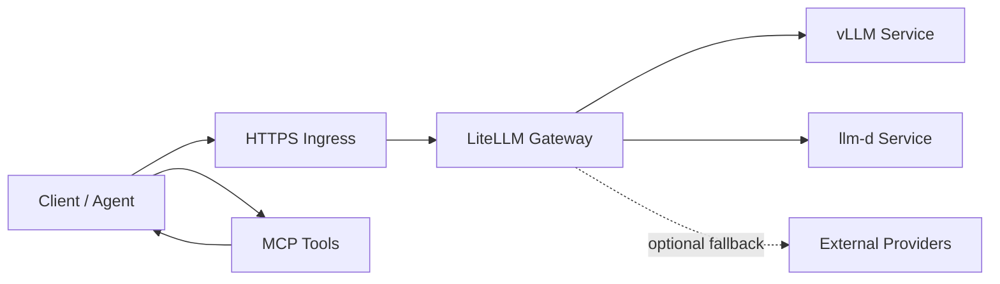

# Repo Name: podforge-llm-gateway

## Goal

Build a Kubernetes-based LLM serving platform on RunPod using k3s, vLLM, llm-d, LiteLLM, MCP integrations, and ingress routing so users and agents can access self-hosted models through a reliable OpenAI-compatible gateway.

## Core Use Case

Use LiteLLM as the main gateway for routing, auth, budget controls, observability, fallback behavior, and provider abstraction across self-hosted models served by vLLM and llm-d.

Inference scope and integration details: [docs/inference-scope.md](docs/inference-scope.md)

LiteLLM and llm-d use-case decision note: [docs/litellm-llmd-use-cases.md](docs/litellm-llmd-use-cases.md)

The platform should support:

- OpenAI-compatible chat/completions APIs.
- Embeddings APIs for the future RAG system.
- Multiple hosted model backends.
- Per-user/team API keys.
- Routing and fallback between models.
- Cost, token, and usage tracking.
- MCP-ready architecture for future agent workflows.
- Public HTTPS ingress to the LiteLLM gateway.

## Proposed Architecture

Main diagram: [docs/architecture.md](docs/architecture.md)

## Step-by-Step Plan

### 1. Create the Repository

- Use repo name: `podforge-llm-gateway`.
- Initialize folders:
  - `infra/` for k3s, ingress, storage, and cluster scripts.
  - `charts/` or `manifests/` for Kubernetes resources.
  - `litellm/` for LiteLLM config, models, keys, and routing.
  - `models/` for vLLM and llm-d deployment specs.
  - `mcp/` for MCP server configs and integration examples.
  - `docs/` for architecture, runbooks, and demos.

### 2. Provision RunPod Infrastructure

- Choose a GPU pod template suitable for the target model size.
- Install or bootstrap k3s on the RunPod instance.
- Validate GPU availability inside Kubernetes using the NVIDIA device plugin.
- Configure persistent storage for model cache and LiteLLM state.

### 3. Configure k3s Base Layer

- Install required cluster components:
  - NVIDIA device plugin.
  - Ingress controller, such as Traefik or NGINX.
  - cert-manager for TLS.
  - Metrics server.
- Create namespaces:
  - `llm-system`
  - `models`
  - `mcp`
  - `observability`

### 4. Deploy vLLM

- Add a Kubernetes deployment for vLLM.
- Mount model cache storage.
- Expose vLLM internally as a Kubernetes service.
- Start with one practical model, for example:
  - `meta-llama/Llama-3.1-8B-Instruct`
  - `Qwen/Qwen2.5-7B-Instruct`
  - `mistralai/Mistral-7B-Instruct`
- Confirm the vLLM endpoint works using its OpenAI-compatible API.

### 5. Deploy llm-d

- Add llm-d manifests or Helm-based deployment.
- Configure it for distributed or optimized model serving where useful.
- Expose llm-d internally through a Kubernetes service.
- Validate that LiteLLM can reach the llm-d endpoint.

### 6. Deploy LiteLLM Gateway

- Deploy LiteLLM in the `llm-system` namespace.
- Configure LiteLLM with:
  - vLLM model endpoint.
  - llm-d model endpoint.
  - Optional external providers.
  - API keys.
  - budgets and rate limits.
  - model aliases.
  - fallback routing.
- Add PostgreSQL or another supported database if using persistent LiteLLM proxy features.

### 7. Build the LiteLLM Use Case

Focus the demo around LiteLLM as the control plane for model access:

- One endpoint for all models.
- User/team API keys instead of exposing model services directly.
- Model aliases like `fast-chat`, `reasoning-chat`, and `cheap-chat`.
- Fallback from a preferred self-hosted model to another model.
- Per-key usage tracking.
- Budget limits for teams.
- Logs and traces for auditability.

### 8. Add MCP Integrations

- Deploy selected MCP servers in the `mcp` namespace.
- Start with useful demo tools:
  - filesystem or document search MCP.
  - GitHub MCP.
  - database MCP.
  - web/search MCP if needed.
- Create an agent demo that calls LiteLLM for model inference and MCP servers for tools.
- Document how MCP servers authenticate and how agents discover available tools.

### 9. Configure Ingress

- Expose only the LiteLLM gateway publicly.
- Keep vLLM, llm-d, MCP servers, and databases private inside the cluster.
- Configure HTTPS:
  - domain name.
  - ingress resource.
  - TLS certificate through cert-manager.
- Add request size, timeout, and streaming settings suitable for LLM responses.

### 10. Add Observability

- Add basic metrics and logs:
  - LiteLLM request logs.
  - GPU utilization.
  - Kubernetes pod metrics.
  - model latency and error rates.
- Optional stack:
  - Prometheus.
  - Grafana.
  - Loki.
  - OpenTelemetry.

### 11. Add Security Controls

- Require LiteLLM API keys for all external access.
- Store secrets in Kubernetes secrets or an external secret manager.
- Use namespace isolation.
- Add network policies if supported.
- Avoid exposing raw model backends publicly.
- Define admin and user roles for LiteLLM management.

### 12. Create Demo Workflows

Prepare demos for:

- Calling the gateway with an OpenAI-compatible client.
- Switching model aliases without changing client code.
- Triggering fallback from vLLM to llm-d.
- Enforcing a user budget.
- Running an MCP-enabled agent through the LiteLLM gateway.
- Observing request logs, latency, and token usage.

## Suggested Milestones

### Milestone 1: Local Repo Skeleton

- Create repo structure.
- Add architecture diagram.
- Add initial k3s bootstrap notes.
- Add placeholder manifests.

### Milestone 2: Single Model Serving

- Provision RunPod.
- Install k3s.
- Deploy NVIDIA device plugin.
- Deploy vLLM.
- Test model inference inside the cluster.

### Milestone 3: LiteLLM Gateway

- Deploy LiteLLM.
- Route requests to vLLM.
- Add API keys and model aliases.
- Expose LiteLLM through ingress.

### Milestone 4: llm-d Integration

- Deploy llm-d.
- Add it as another LiteLLM backend.
- Configure fallback and routing.

### Milestone 5: MCP Agent Demo

- Deploy one or more MCP servers.
- Build an agent demo using LiteLLM for inference and MCP for tools.
- Document the end-to-end flow.

### Milestone 6: Production Hardening

- Add TLS, secrets, budgets, logs, metrics, and runbooks.
- Add backup and restore notes.
- Add scaling and cost guidance.

## First Files to Create Next

- `README.md`
- `docs/architecture.md`
- `infra/k3s-bootstrap.md`
- `manifests/namespaces.yaml`
- `models/vllm-deployment.yaml`
- `models/llmd-deployment.yaml`
- `litellm/config.yaml`
- `litellm/deployment.yaml`
- `mcp/README.md`
- `docs/demo-script.md`

## Success Criteria

- A user can send an OpenAI-compatible request to a public HTTPS LiteLLM endpoint.
- LiteLLM routes the request to a private vLLM or llm-d backend.
- API keys, budgets, aliases, and fallback behavior work.
- MCP-enabled agent workflows can use the gateway for inference.
- Raw model services remain private inside k3s.
