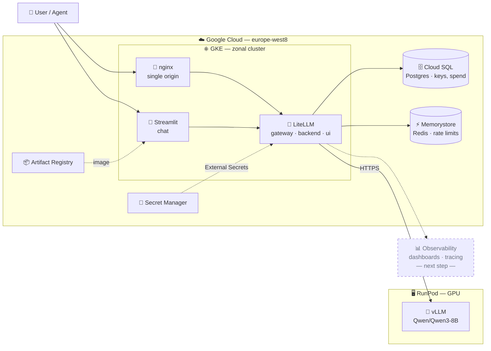

# Terraforge Inference

A self-hosted LLM gateway on Google Cloud, serving a model that runs on rented GPUs.

GPUs are the expensive part, and RunPod is cheap for them — so **the model lives on RunPod** under vLLM, and **everything else lives on GKE**: the gateway that authenticates callers and enforces budgets, its data stores, and the chat UI. Every request goes through LiteLLM, so the model alias, the key and the spend limits are one edit in one place rather than a change in every caller.

## Architecture



Secrets never touch a runner or a values file: External Secrets Operator reads Secret Manager from inside the cluster using Workload Identity. Cloud SQL and Memorystore are reached on private IPs over the VPC.

## Layout

| Path | What |
|---|---|
| `terraform/` | VPC, GKE, Cloud SQL, Memorystore, Secret Manager, Artifact Registry, IAM |
| `gke/litellm/` | LiteLLM chart values, secret wiring, and the UI reverse proxy |
| `gke/streamlit/` | Chat UI deployment |
| `streamlit/` | Chat UI source and image |
| `observability/` | Prometheus stack, Langfuse, evaluation jobs |

## Pipelines

Each stage gates before it can reach the cluster: format, validate, policy (conftest/OPA), and secret scanning run without cloud credentials, and only what passes reaches a job that can authenticate. Authentication is Workload Identity Federation — no service-account key exists in this repo.

| Workflow | Trigger | Does |
|---|---|---|
| **Infra Build** | push to `terraform/**` | `terraform apply` |
| **Infra Destroy** | dispatch only | tears down everything; requires typing the project ID |
| **LiteLLM Deploy** | push to `gke/**` | gateway, secret wiring, UI proxy |
| **Streamlit Deploy** | push to `streamlit/**` | builds by digest, rolls out |
| **Observability** | **dispatch only** | monitoring stack · evaluations |
| **Langfuse Deploy** | **dispatch only** | tracing backend |

The last two never deploy on push — they hold `deploy`, `run-eval` and `uninstall` actions and make you choose one.

## Access

Services are ClusterIP; nothing is exposed publicly.

```bash
kubectl -n llm-system port-forward svc/litellm-proxy 8080:80   # http://localhost:8080/ui
kubectl -n llm-system port-forward svc/streamlit     8501:80   # http://localhost:8501
```

The admin UI needs its own origin for the dashboard and the API it calls, which is what `litellm-proxy` provides — port-forwarding `litellm-ui` directly returns HTML for every API call and the console fails on `JSON.parse`.

## Current model

`Qwen/Qwen3-8B` on vLLM, 8128-token context, registered in LiteLLM and reached by alias. Measured through the gateway with `lm-evaluation-harness`:

| Task | Metric | Score |
|---|---|---|
| gsm8k | exact_match | 0.93 |
| humaneval | pass@1 | 0.82 |
| mbpp | pass@1 | 0.64 |
| arc_challenge | acc / acc_norm | 0.55 / 0.52 |
| truthfulqa_mc2 | acc | 0.54 |

## Next steps

**Observability is the next phase.** The Prometheus stack and evaluation jobs are deployed and collecting scores, but the work that makes them useful is still ahead:

- **Grafana dashboards** — gateway latency split into overhead versus time in the model, spend and token burn per key, per-deployment health.
- **Langfuse tracing** — the chart and its secrets are ready to deploy; the OpenTelemetry callback in LiteLLM stays off until its project keys exist.
- **Engine metrics** — `scrapeconfig-vllm.yaml` targets vLLM's own `/metrics` and is applied by name once the trade of exposing it is accepted.
- **Load profiles** — `guidellm` throughput and TTFT baselines, run one profile at a time so they do not distort each other.

Beyond that: an embedding model, virtual keys with per-team budgets in place of the master key, and an Ingress once a certificate provisions cleanly.
