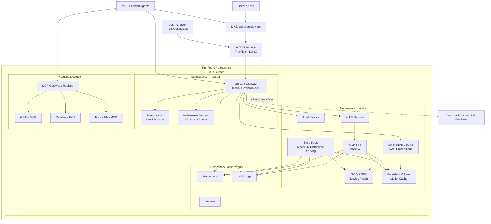

# Main Architecture

## Traffic Flow

1. Users and agents call `https://api.example.com`.
2. Ingress terminates HTTPS and forwards traffic to LiteLLM.
3. LiteLLM handles API keys, routing, model aliases, budgets, logs, and fallbacks.
4. LiteLLM sends inference requests to private vLLM or llm-d services.
5. MCP-enabled agents use MCP servers for tools and LiteLLM for model inference.
6. Observability collects gateway, model, GPU, and cluster signals.

## Security Boundary

- Public: DNS and HTTPS ingress.
- Public API surface: LiteLLM only.
- Private: vLLM, llm-d, MCP servers, databases, model cache, and observability tools.
