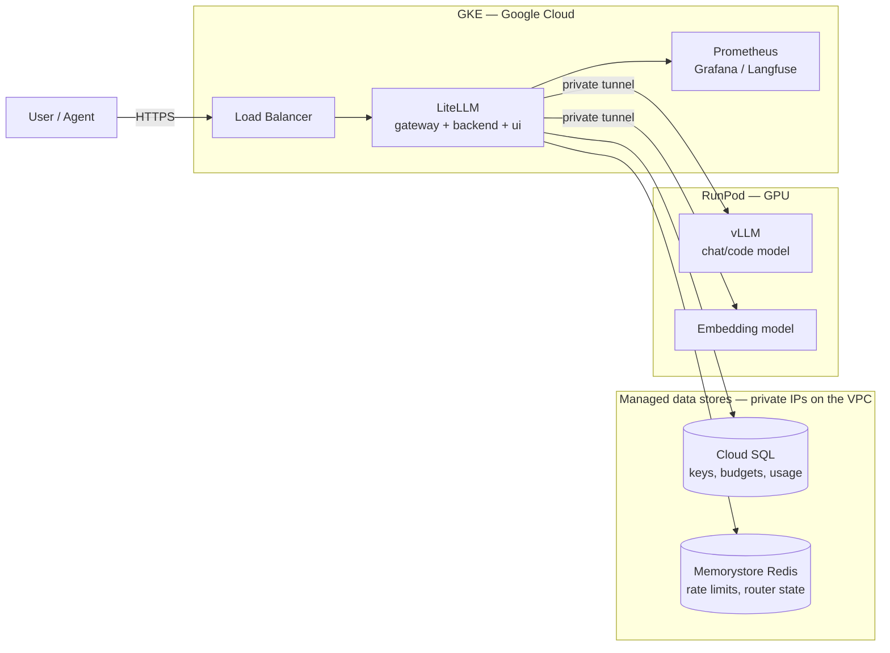
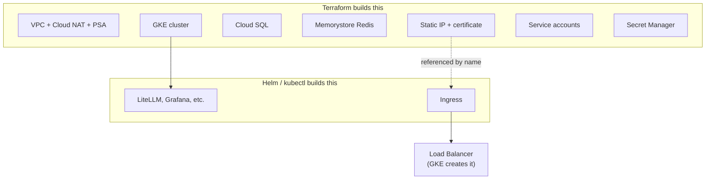
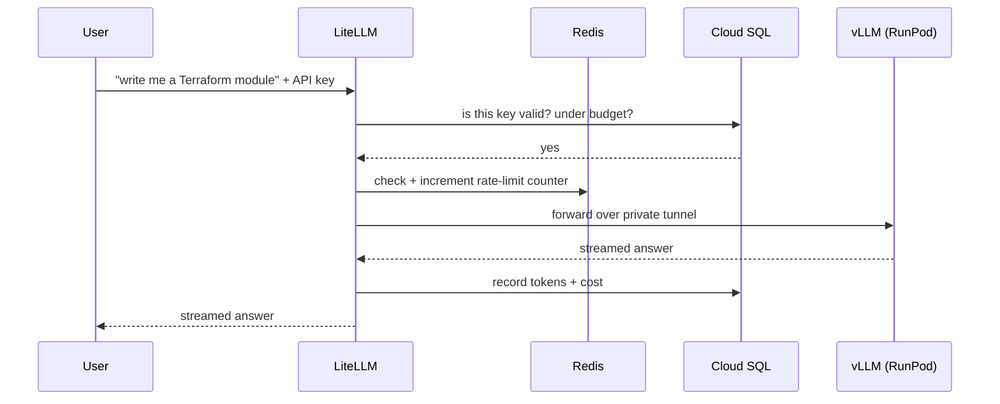
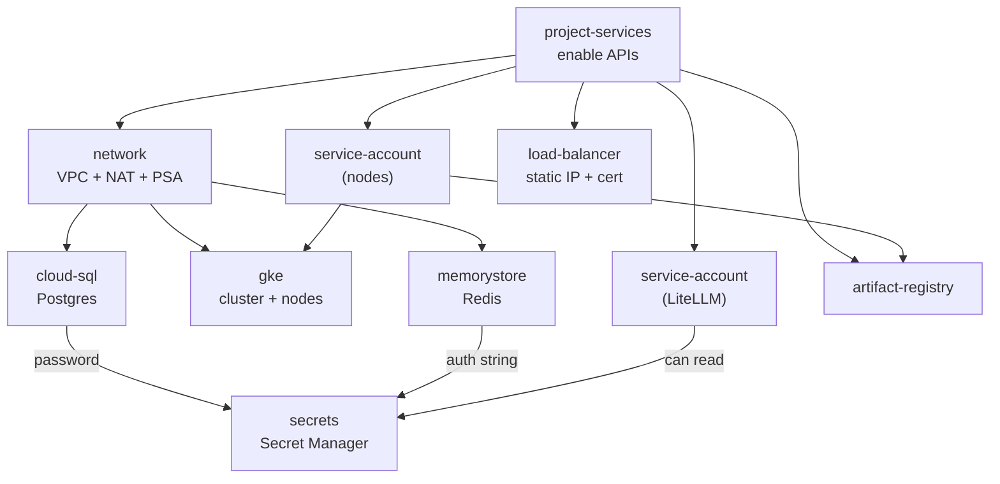

# Infrastructure

Two clouds. GPUs are expensive and RunPod is cheap for them, so **the models live on RunPod**. Everything else — the gateway, its data stores, the dashboards — lives on **GKE**.

## The big picture



**Only the load balancer is public.** The models have no public address at all — the only way to reach them is through LiteLLM, which is what makes API keys, budgets, and rate limits enforceable. If the models were public, anyone with the URL could skip all of that.

Cloud SQL and Redis are equally private: neither has a public IP. They sit on the cluster's VPC through Private Services Access, so only workloads inside the VPC can reach them.

## Who creates what

A common surprise: **Terraform does not create the load balancer.** Terraform reserves the IP address; GKE builds the load balancer later when you install LiteLLM.



The order is: `terraform apply` reserves the IP → you install LiteLLM → GKE sees the Ingress and builds the load balancer on that IP. The address is known and stable before LiteLLM ever starts.

## What a request looks like



Redis is what makes those counters correct across replicas. On a single instance LiteLLM can hold them in memory; with two or more, each would enforce its own separate limit.

## What Terraform creates

| Resource | Why |
|---|---|
| VPC + subnet | Private network for the cluster |
| **Cloud NAT** | Private nodes have no public IP — without NAT they can't pull images **or reach RunPod** |
| **Private Services Access** | The peering that lets Cloud SQL and Redis have private IPs on this VPC |
| GKE cluster (zonal) | Runs LiteLLM and observability. Zonal = free management tier |
| Node pool, 2× e2-standard-4 | No GPUs; models are on RunPod |
| Cloud SQL Postgres 18 | LiteLLM state + Langfuse. Private IP only |
| Memorystore Redis | Rate limiting, router state, cross-replica cache. Private, AUTH enabled |
| Artifact Registry | Container images, if you build any |
| Static IP + managed certificate | The stable public address and its TLS |
| Service accounts + Workload Identity | Lets LiteLLM authenticate with no key file |
| Secret Manager | Generated credentials, plus empty slots for ones issued elsewhere |

## Secrets

Four are generated and filled by Terraform:

```
<env>-db-password        <env>-litellm-master-key
<env>-litellm-salt-key   <env>-redis-password
```

Five are created **empty**, for values issued outside Terraform. Anything reading them fails loudly until you add a version, which is the intent:

```
<env>-vllm-api-key   <env>-embedding-api-key   <env>-tailscale-authkey
<env>-langfuse-secret   <env>-hf-token
```

```bash
terraform output secrets_to_fill
gcloud secrets versions add terraforge-dev-tailscale-authkey --data-file=-
```

There is deliberately **no composed `DATABASE_URL`**. Interpolating the sensitive password with the instance IP — unknown until apply — produces a value that is both sensitive and unknown at plan time, which the provider rejects outright. The Helm chart takes host, database name, and credentials separately anyway.

## Wiring the Helm chart

Outputs map onto `values.yaml` directly:

| Output | Helm value |
|---|---|
| `database_host` | `database.writer.host` |
| `database_name` | `database.writer.dbname` |
| `database_user` | username key of the db secret |
| `redis_host` / `redis_port` | `redis.host` / `redis.port` |
| `litellm_hostname` | `ingress.host` |
| `litellm_ip_name` | `kubernetes.io/ingress.global-static-ip-name` |
| `litellm_certificate_name` | `ingress.gcp.kubernetes.io/pre-shared-cert` |

Use `className: "gce"` for the Ingress on GKE.

## Three things that will bite you

**1. Streaming gets cut off at 30 seconds.** Google's load balancer defaults to a 30s backend timeout. LiteLLM streams answers token by token, and a long Terraform generation runs past that — the connection drops mid-answer and looks like a model bug. Fix is a `BackendConfig` with `timeoutSec: 3600` on the LiteLLM Service.

**2. A GCP load balancer has no DNS name.** Unlike an AWS ELB, which hands you `app-lb-123.eu-west-2.elb.amazonaws.com`, GCP gives you an IP and nothing else. Google-managed certificates can't be issued for a bare IP, so that would normally mean no HTTPS until you buy a domain.

The workaround is wildcard DNS: `nip.io` resolves `34.1.2.3.nip.io` to `34.1.2.3` — no registration, no records to manage. The IP is reserved and static, so the hostname is stable too, and a managed certificate *can* be issued for it because validation only requires the name to resolve to this load balancer.

```
litellm_endpoint = "https://34.1.2.3.nip.io"
```

Set `domain` in `terraform.tfvars` when you have a real one and it takes precedence automatically. Certificates take 15–60 minutes to go ACTIVE; HTTP works immediately.

**3. The certificate annotation is easy to get wrong.** `networking.gke.io/managed-certificates` refers to the GKE `ManagedCertificate` CRD. Terraform creates a *Compute* certificate, which attaches with `ingress.gcp.kubernetes.io/pre-shared-cert`. The wrong one silently gives you no TLS.

## Rough cost

| Item | Per month |
|---|---|
| 2× e2-standard-4 nodes | ~$100 |
| Cloud SQL `db-g1-small` | ~$28 |
| Memorystore Redis, 1GB BASIC | ~$40 |
| Load balancer | ~$18 |
| Cloud NAT | ~$32 |
| GKE management (zonal free tier) | $0 |
| **GKE total** | **~$220** |

RunPod GPU is billed separately by the hour — stop the pod when you're not using it.

## How the Terraform is organised

Nine small modules, wired together by one root `main.tf`.



`service-account` is used twice — once for the nodes, once for LiteLLM — which is the point of writing it as a module. Cloud SQL and Redis both depend on `network` because Private Services Access must exist before either can get a private IP.

## Policy gate

`policy/*.rego` is evaluated by conftest against the plan JSON in CI. It denies primitive IAM roles, service account keys, public IAM members, an open database, missing Cloud SQL backups, unencrypted connections, and hardcoded passwords. It *warns*, without failing, that the GKE control plane is open to `0.0.0.0/0` — deliberate for a study cluster, since it still requires IAM authentication.

## Running it

CI is the normal path: `.github/workflows/infra-build.yml` on push, `infra-destroy.yml` by hand.

Locally:

```bash
cd terraform
cp backend.hcl.example backend.hcl
terraform init -backend-config=backend.hcl
terraform plan
terraform apply

# then point kubectl at the new cluster
$(terraform output -raw get_credentials)
```

Details and design rationale: [../PLAN.md](../PLAN.md). Build order: [../Step.md](../Step.md).
