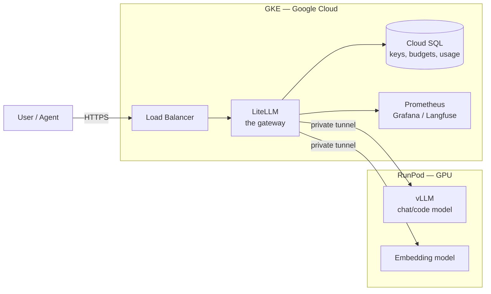
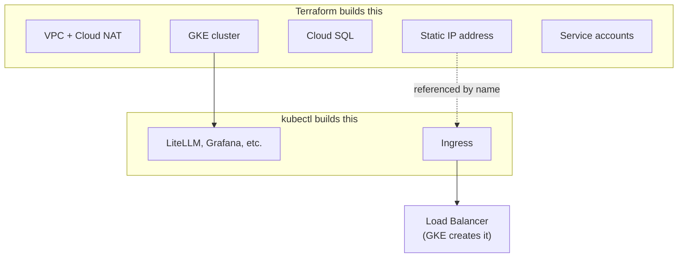
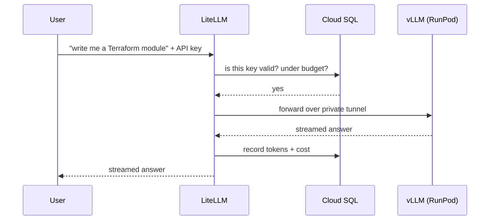
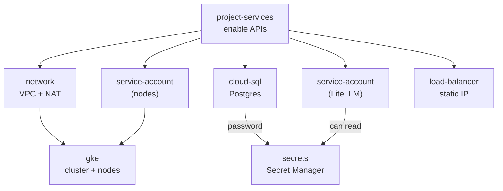

# Infrastructure

Two clouds. GPUs are expensive and RunPod is cheap for them, so **the models live on RunPod**. Everything else — the gateway, the database, the dashboards — lives on **GKE**.

## The big picture



**Only the load balancer is public.** The models have no public address at all — the only way to reach them is through LiteLLM, which is what makes API keys, budgets, and rate limits actually enforceable. If the models were public, anyone with the URL could skip all of that.

## Who creates what

A common surprise: **Terraform does not create the load balancer.** Terraform reserves the IP address; GKE builds the load balancer later when you install LiteLLM.



So the order is: `terraform apply` reserves the IP → you install LiteLLM → GKE sees the Ingress and builds the load balancer on that IP. The address is known and stable before LiteLLM ever starts.

## What a request looks like



## What Terraform creates


| Resource                             | Why                                                                                      |
| ------------------------------------ | ---------------------------------------------------------------------------------------- |
| VPC + subnet                         | Private network for the cluster                                                          |
| **Cloud NAT**                        | Private nodes have no public IP — without NAT they can't pull images**or reach RunPod** |
| GKE cluster (zonal)                  | Runs LiteLLM and observability. Zonal = free management tier                             |
| Node pool, 2× e2-standard-4         | No GPUs; models are on RunPod                                                            |
| Cloud SQL Postgres                   | LiteLLM state + Langfuse                                                                 |
| Static IP                            | The stable public address                                                                |
| Service accounts + Workload Identity | Lets LiteLLM reach the database with no password file                                    |
| Secret Manager                       | Generated DB password and LiteLLM keys                                                   |

## Two things that will bite you

**1. Streaming gets cut off at 30 seconds.** Google's load balancer defaults to a 30s backend timeout. LiteLLM streams answers token by token, and a long Terraform generation runs past that — the connection drops mid-answer and looks like a model bug. Fix is a `BackendConfig` with `timeoutSec: 3600` on the LiteLLM Service.

**2. A GCP load balancer has no DNS name.** Unlike an AWS ELB, which hands you `app-lb-123.eu-west-2.elb.amazonaws.com`, GCP gives you an IP and nothing else. Google-managed certificates can't be issued for a bare IP, so that would normally mean no HTTPS until you buy a domain.

The workaround is wildcard DNS: `nip.io` resolves `34.1.2.3.nip.io` to `34.1.2.3` — no registration, no records to manage. The IP is reserved and static, so the hostname is stable too, and a managed certificate *can* be issued for it because validation only requires the name to resolve to this load balancer.

Terraform derives it for you:

```
litellm_endpoint = "https://34.1.2.3.nip.io"
```

Set `domain` in `terraform.tfvars` when you have a real one and it takes precedence automatically.

## Rough cost


| Item                             | Per month |
| -------------------------------- | --------- |
| 2× e2-standard-4 nodes          | ~$100     |
| Cloud SQL`db-g1-small`           | ~$28      |
| Load balancer                    | ~$18      |
| Cloud NAT                        | ~$32      |
| GKE management (zonal free tier) | $0        |
| **GKE total**                    | **~$180** |

RunPod GPU is billed separately by the hour — stop the pod when you're not using it.

## How the Terraform is organised

Seven small modules, wired together by one root `main.tf`.



`service-account` is used twice — once for the nodes, once for LiteLLM — which is the point of writing it as a module.

## Running it

```bash
cd terraform
terraform init
terraform plan
terraform apply

# then point kubectl at the new cluster
$(terraform output -raw get_credentials)
```

Details and design rationale: [PLAN.md](PLAN.md). Build order: [Step.md](Step.md).
